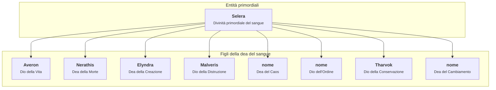

```mermaid
flowchart TB
    subgraph Entita["Entità primordiali"]
	    A["<b>Selera</b>\n<small>Divinità primordiale del sangue</small>"]
	end
	
	subgraph Figli["Figli della dea del sangue"]
		B["<b>Averon</b>\n<small>Dio della Vita</small>"]
		C["<b>Nerathis</b>\n<small>Dea della Morte</small>"]
		D["<b>Elyndra</b>\n<small>Dea della Creazione</small>"]
		E["<b>Malveris</b>\n<small>Dio della Distruzione</small>"]
		F["<b>nome</b>\n<small>Dea del Caos</small>"]
		G["<b>nome</b>\n<small>Dio dell'Ordine</small>"]
		H["<b>Tharvok</b>\n<small>Dio della Conservazione</small>"]
		I["<b>nome</b>\n<small>Dea del Cambiamento</small>"]
	end
	

    A --> B
    A --> C
    A --> D
    A --> E
    A --> F
    A --> G
    A --> H
    A --> I
    
    click A "obsidian://open?vault=Film&file=Selera"
    click B "obsidian://open?vault=Film&file=Averon"
    click C "obsidian://open?vault=Film&file=Nerathis"
    click D "obsidian://open?vault=Film&file=Elyndra"
    click H "obsidian://open?vault=Film&file=Tharvok"
```

